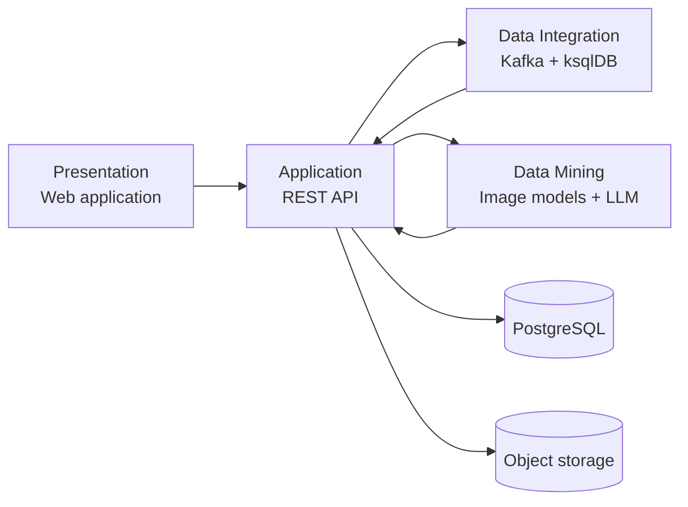

# PlantGuard

Интеллектуальная система поддержки принятия решений для распознавания комнатных растений, диагностики и мониторинга их состояния по фотографиям, текстовым описаниям и истории ухода.

## Авторы

- Вышенская Екатерина
- Верхоланцева Екатерина
- группа РИС-26-1м

## Идея проекта

PlantGuard помогает владельцу растения принять обоснованное решение об уходе. Пользователь фотографирует растение, описывает симптомы и при необходимости добавляет данные о поливе, влажности и температуре. Система:

1. предлагает наиболее вероятные виды растения;
2. определяет видимые признаки неблагополучия;
3. сопоставляет фотографию с описанием, условиями содержания и историей ухода;
4. формирует объяснимую оценку состояния и рекомендации;
5. предлагает повторить наблюдение и сравнивает состояние во времени.

Ключевая особенность проекта — повторная оценка одного и того же растения. При новом наблюдении PlantGuard учитывает предыдущие фотографии и события ухода, отмечает изменения и сообщает, достаточно ли данных для достоверного сравнения.

Пример результата:

> Вероятнее всего, это фикус Бенджамина — 91%. На двух последовательных снимках увеличилась область пожелтения нижнего листа. За последние три дня влажность почвы была выше заданного диапазона. Рекомендуется проверить дренаж и сократить полив. Если состояние продолжит ухудшаться, потребуется дополнительный снимок нижней стороны листа.

PlantGuard показывает предположения и уровень уверенности модели. Если данных недостаточно, система запрашивает уточнение или предлагает выбрать вид растения вручную.

## Архитектура

Проект разделён на четыре слоя:



- **Presentation** — загрузка фотографий, описание симптомов, карточки растений, история наблюдений и сравнение снимков.
- **Application** — пользователи, растения, наблюдения, правила принятия решений и объединение результатов анализа.
- **Data Integration** — события наблюдений и ухода, показатели среды, потоковые агрегаты и предупреждения.
- **Data Mining** — распознавание вида, анализ визуальных признаков и изменений, разбор текста и формирование объяснений.

Подробное описание компонентов находится в [docs/architecture.md](docs/architecture.md).

## Структура репозитория

```text
apps/web/                  веб-интерфейс
services/api/              прикладной REST API
services/mining/           интерфейсы моделей и правила оценки
contracts/events/          версионируемые схемы событий
data-integration/ksqldb/   потоковые запросы ksqlDB
tests/                     проверки архитектуры и контрактов
docs/                      проектная документация
```

## Локальный запуск

Требования:

- Docker с поддержкой Compose;
- Node.js 22 или новее;
- Python 3.11 или новее.

```bash
cp .env.example .env
docker compose up --build
```

После запуска:

- веб-приложение: `http://localhost:5173`;
- API и OpenAPI: `http://localhost:8000/docs`;
- ksqlDB REST API: `http://localhost:8088`.

## Тестирование

```bash
make test
```

Тестовый контур постепенно покрывает следующие критерии:

- фотография принимается и связывается с наблюдением;
- сервис анализа возвращает результат по заданному контракту;
- низкая уверенность приводит к запросу подтверждения, а не к уверенному диагнозу;
- ручное исправление вида учитывается в последующих оценках;
- ksqlDB объединяет события по растению и создаёт предупреждения;
- повторные и запоздавшие события обрабатываются предсказуемо;
- при недоступности модели пользователь получает безопасный резервный ответ;
- полный сценарий проходит от первого снимка до повторного наблюдения.

## Состояние проекта

Проект находится на этапе формирования технической основы. Первая версия будет ограничена несколькими видами комнатных растений и небольшим набором визуальных признаков. Границы первой версии описаны в [docs/mvp.md](docs/mvp.md).

PlantGuard не заменяет консультацию специалиста. Рекомендации системы должны быть проверяемыми, объяснимыми и безопасными для растения.
